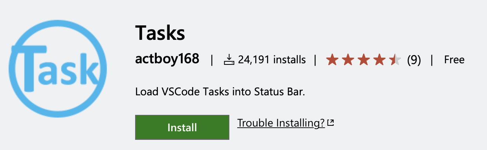

# MBARI

## Setup

Getting up and going should be straightforward unless you're on windows. Simply install the project dependencies and start the client workspace. See the specific README for each workspace for any additional setup that may be required.

You can confirm the package builds and tests verify quickly via turborepo:

```
yarn install
yarn build
yarn test
```

You can install [NVM](https://github.com/nvm-sh/nvm) and the [Tasks extension](https://marketplace.visualstudio.com/items?itemName=actboy168.tasks) to gain access to a set of convenience commands in your VSCode task bar to start various packages and run tests:



If you install this extension, you should see the following options in your status bar:

- **Storybook**: `yarn workspace ui start`
- **Tailwind**: `yarn workspace ui tailwind`
- **UI Tests**: `yarn workspace @mbari/react-ui test:watch`
- **Lint**: `yarn esw`
- **Build**: `yarn test; yarn build`
- **Run**: `yarn build; yarn workspace @mbari/lrauv-dash2 start`

### A Note on Monorepo Dependencies

Some projects in this repo depend on their siblings. For example the `@mbari/react-ui` package depends on `@mbari/utils` package. If you update `@mbari/utils` you will need to run `yarn build` from the project root to rebuild the packages and then restart your storybook and test runner so that the updated build is loaded.

### Deployment

Deployments are handled automatically via [CircleCI](https://www.circleci.com).

## Packages

### @mbari/react-ui

A typescript based module that utilizes tailwind css and react storyboard to build, manage, and document the interface components used on the dash2 client application. We've pre-fixed the ui workspace with 'react' to future proof in case we create a duplicate component set in another framework down the road (i.e. Vue.js)

### @mbari/utils

A common set of helper functions we may use in various packages within this monorepo.

### @mbari/api-client

An axios library containing typed api requests and responses from the tethysdash API. There is also react-query module for usage in the react client.

## Apps

### @mbari/lrauv-dash2

This is the client side application for the second iteration of the LRAUV Dash application.
