# Map-related dependency flow

Mermaid diagram of Map, DeploymentMap, VehiclePath, elevationService, MapDepthDisplay, and related modules. Highlights **data/control flow** and **import dependencies**; callouts mark possible circular or fragile patterns.

```mermaid
flowchart TB
  subgraph app["apps/lrauv-dash2"]
    _app["_app.tsx"]
    index["pages/index.tsx\n(OverViewMap)"]
    deploymentPage["pages/vehicle/[...deployment].tsx"]
    DeploymentMap["DeploymentMap.tsx"]
    VehiclePath["VehiclePath.tsx"]
    MapClickHandler["MapClickHandler.tsx"]
    ClickableMapPoint["ClickableMapPoint.tsx"]
    GoogleMapsProvider["GoogleMapsProvider.tsx"]
    MapLayersListModal["MapLayersListModal.tsx"]
    DraggableMarker["DraggableMarker.tsx"]
    CustomMarkerSet["CustomMarkerSet.tsx"]
    WaypointPreviewPath["WaypointPreviewPath.tsx"]
    PlatformPaths["PlatformPaths.tsx"]
    StationMarker["StationMarker.tsx"]
  end

  subgraph lib["apps/lrauv-dash2/lib"]
    useGoogleElevator["useGoogleElevator.ts"]
    elevationService["elevationService.ts"]
    leafletPlugins["leafletPlugins.ts"]
    useGoogleMaps["useGoogleMaps.ts"]
  end

  useGoogleMapsApiKey["useGoogleMapsApiKey.ts"]
  useTrackedVehicles["useTrackedVehicles.ts"]

  subgraph reactui["packages/react-ui"]
    Map["Map/Map.tsx"]
    MapDepthDisplay["Map/MapDepthDisplay.tsx"]
    MouseCoordinates["Map/MouseCoordinates.tsx"]
    MapViews["Map/MapViews.tsx"]
    MapTypes["Map/Map.types.ts"]
    Measurement["Map/Measurement.tsx"]
    MovingDot["Map/MovingDot.tsx"]
    useMapBaseLayer["Map/useMapBaseLayer.ts"]
    useManagedWaypoints["Modals/.../useManagedWaypoints.ts"]
  end

  subgraph external["external"]
    react-leaflet["react-leaflet"]
    leaflet["leaflet"]
    utils["@mbari/utils"]
    apiClient["@mbari/api-client"]
  end

  %% === App entry & provider ===
  _app --> GoogleMapsProvider
  GoogleMapsProvider --> leafletPlugins
  GoogleMapsProvider --> useGoogleMapsApiKey
  leafletPlugins -.->|"loads script\n(no TS import)"| leaflet

  %% === Pages use map components ===
  index --> useGoogleElevator
  index --> useGoogleMaps
  index -->|dynamic| Map
  index -->|dynamic| MapDepthDisplay
  index -->|dynamic| VehiclePath
  index --> MapLayersListModal
  deploymentPage -->|dynamic| DeploymentMap
  deploymentPage --> useGoogleMaps

  %% === DeploymentMap is the main map host ===
  DeploymentMap -->|dynamic import| Map
  DeploymentMap -->|dynamic import| MapDepthDisplay
  DeploymentMap --> useGoogleElevator
  DeploymentMap --> useManagedWaypoints
  DeploymentMap --> useTrackedVehicles
  DeploymentMap -->|dynamic| VehiclePath
  DeploymentMap -->|dynamic| ClickableMapPoint
  DeploymentMap -->|dynamic| MapClickHandler
  DeploymentMap -->|dynamic| DraggableMarker
  DeploymentMap -->|dynamic| CustomMarkerSet
  DeploymentMap -->|dynamic| WaypointPreviewPath
  DeploymentMap -->|dynamic| PlatformPaths
  DeploymentMap -->|dynamic| StationMarker
  DeploymentMap --> MapLayersListModal
  DeploymentMap --> SelectedStations["SelectedStationContext"]
  DeploymentMap --> MarkerCtx["MarkerContext"]

  %% === Elevation chain (one-way, no cycle) ===
  useGoogleElevator --> elevationService
  elevationService --> utils
  DeploymentMap -->|"handleDepthRequest"| MapDepthDisplay
  index -->|"handleDepthRequest"| MapDepthDisplay

  %% === react-ui Map internal ===
  Map --> useMapBaseLayer
  Map --> MapTypes
  Map --> Measurement
  Map --> MovingDot
  Map --> MapViews
  Map -->|re-export| MapDepthDisplay
  MapDepthDisplay --> MouseCoordinates
  MapDepthDisplay --> utils
  MapDepthDisplay --> react-leaflet
  MouseCoordinates --> react-leaflet
  MouseCoordinates --> utils
  MovingDot --> Measurement
  Measurement --> react-leaflet
  Measurement --> leaflet
  MapViews --> react-leaflet
  useMapBaseLayer --> recoil["recoil"]

  %% === VehiclePath (no import of Map/DeploymentMap) ===
  VehiclePath --> apiClient
  VehiclePath --> react-leaflet
  VehiclePath --> SharedPathContextProvider
  VehiclePath --> VehicleColorsContext

  %% === Other map children ===
  ClickableMapPoint --> react-leaflet
  ClickableMapPoint -.->|"⚠ from 'react-ui/dist'"| useManagedWaypoints
  MapClickHandler --> react-leaflet
  DraggableMarker --> react-leaflet
  CustomMarkerSet --> react-leaflet
  WaypointPreviewPath --> react-leaflet
  PlatformPaths --> PlatformPath["PlatformPath"]
  PlatformPaths --> usePlatformList["usePlatformList"]

  %% Styling for notes
  classDef warn fill:#f9f,stroke:#333,stroke-width:2px
  classDef lib fill:#bfb,stroke:#333
  classDef pkg fill:#bbf,stroke:#333
  class ClickableMapPoint warn
```

## Legend

- **Solid arrows**: direct or dynamic `import` / dependency.
- **Dashed arrows**: data passed as props or runtime dependency (e.g. `handleDepthRequest`), or non-TypeScript load (e.g. script tag).
- **Subgraphs**: app vs lib vs react-ui vs external.

## Circular dependency check

- **No circular imports** among Map, DeploymentMap, VehiclePath, elevationService, and MapDepthDisplay.
- Flow is one-way: app → react-ui Map (and MapDepthDisplay); app → useGoogleElevator → elevationService; depth callback is passed from app into MapDepthDisplay as a prop.

## Potential issues

| Item                          | Description                                                                                                                                                                                                                |
| ----------------------------- | -------------------------------------------------------------------------------------------------------------------------------------------------------------------------------------------------------------------------- |
| **ClickableMapPoint**         | Imports `useManagedWaypoints` from `'react-ui/dist'` instead of `'@mbari/react-ui'`. Fragile (tied to build output) and inconsistent with the rest of the app.                                                             |
| **Duplicate dynamic imports** | `pages/index.tsx` and `DeploymentMap.tsx` both dynamically import Map, MapDepthDisplay, VehiclePath, etc. Consider a small “map bundle” or shared lazy component to avoid duplication and ensure one place for SSR: false. |
| **Cross-feature dependency**  | `DeploymentMap` depends on `useManagedWaypoints` from react-ui’s **Modals** (mission modal). Map feature is coupled to mission modal hooks; changes in Modals can affect map behavior and re-renders.                      |
| **elevationService**          | Singleton + `window` flag; fine for one app, but ensure only one initializer (e.g. GoogleMapsProvider / leafletPlugins) loads the Google script so elevation and map stay in sync.                                         |

## Depth data flow (summary)

1. **GoogleMapsProvider** (in \_app) runs **leafletPlugins.initLeafletGoogle(apiKey)**, which loads Google Maps (with elevation) and the Leaflet Google layer.
2. **useGoogleElevator** uses **elevationService** (`getElevationService`, `getCachedElevation`) and exposes **handleDepthRequest**.
3. **DeploymentMap** (and **index** for OverViewMap) call **useGoogleElevator()** and pass **handleDepthRequest** into **MapDepthDisplay** as the **depthRequest** prop.
4. **MapDepthDisplay** uses **useDepthRequest(depthRequest, options)** from `@mbari/utils` and **MouseCoordinates**; it renders coordinates + depth in the map’s top-right pane.

No cycle in this chain; elevation is app → service → hook → prop → MapDepthDisplay.
